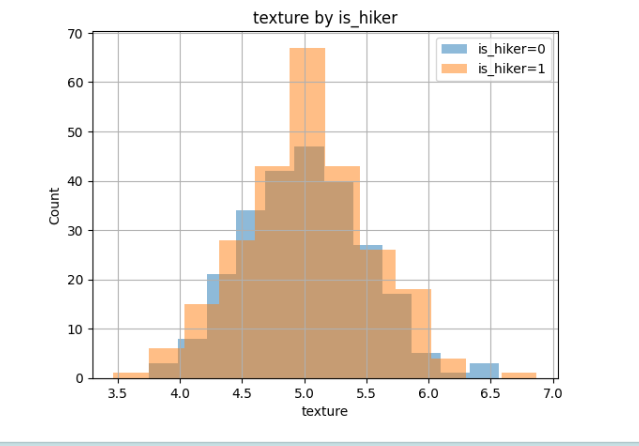

# avalanchemior ⛷️🏔️
avalanchemior : Safety & Rescue Technology # Optimize Model Performance # ROC # AUC # scikit-learn

## Objective
- Create ROC curves.
- Explore how to assess and compare models using these curves
- Practice fine-tuning a model using characteristics plotted on ROC curves

## 	Measure and optimize model performance with ROC and AUC 

